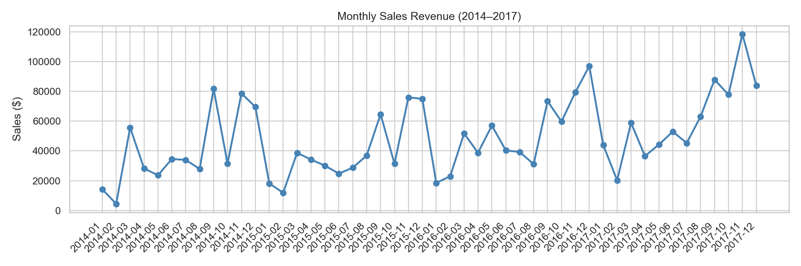
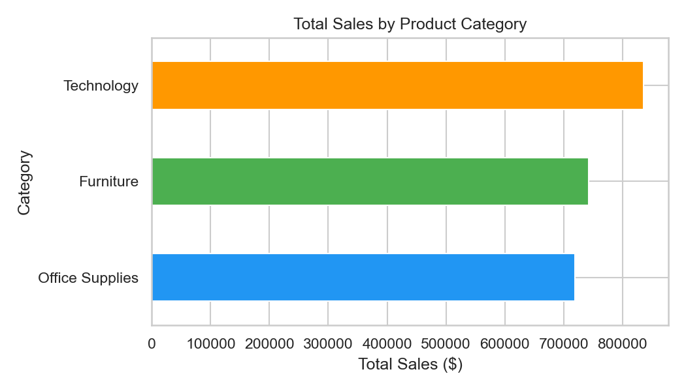
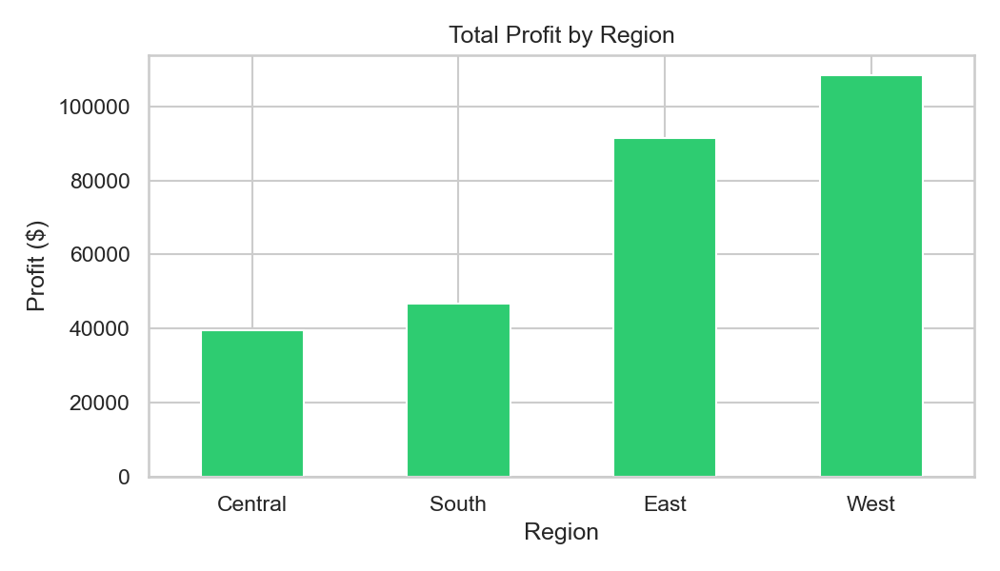
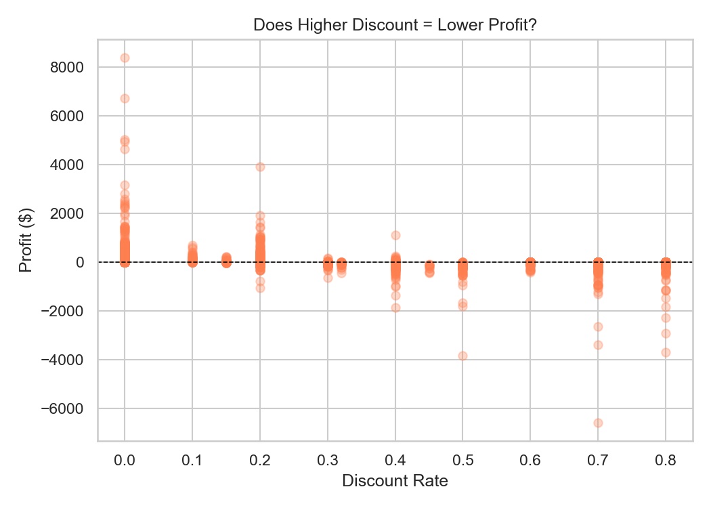
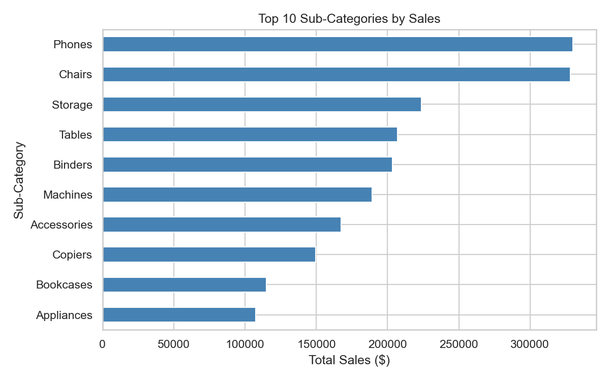
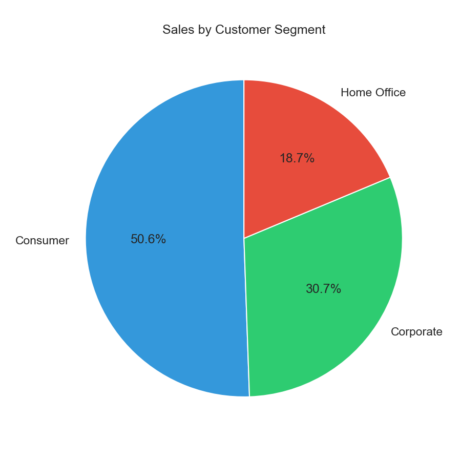

# Superstore Sales & Profitability Analysis 📊

An end-to-end data analysis project using **Python** to uncover key sales drivers, regional performance, and the impact of discounting on profitability for a retail superstore.

## 🚀 Project Overview
This project analyzes 4 years of retail data (9,994 orders) to provide actionable business recommendations based on revenue trends and profit margins.

---

## 📈 Key Insights & Visualizations

### 1. Monthly Sales Trends
Sales show consistent year-over-year growth with significant peaks in **Q4** (Oct–Dec), likely driven by holiday shopping.

### 2. Category Performance
**Technology** is the highest revenue generator, followed by Furniture and Office Supplies.

### 3. Regional Profitability
The **West** region is the most profitable, while the **Central** region lags behind. Investigation is needed into Central's operating costs.

### 4. The "Discount Trap"
There is a sharp decline in profit when discounts exceed **20%**. Discounts above **40%** almost always result in a net loss.

### 5. Top 10 Sub-Categories
**Phones** and **Chairs** are the top individual revenue drivers.

### 6. Sales by Segment
The **Consumer** segment makes up over **50%** of total sales, though Home Office shows the highest growth potential.

---

## 🛠️ Tools Used
* **Language:** Python
* **Libraries:** Pandas, Matplotlib, Seaborn
* **Environment:** Jupyter Notebook
